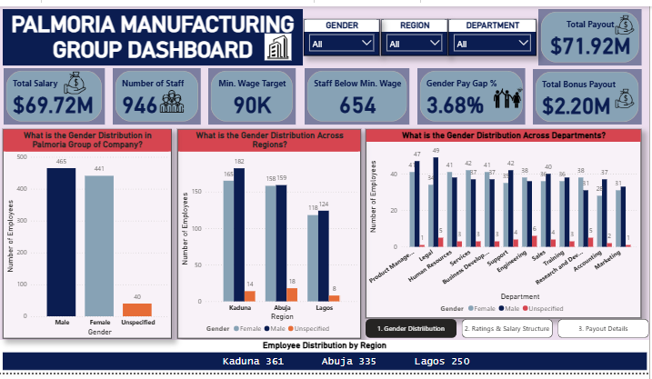

# Palmoria-Manufacturing-Group-From-Crisis-to-Clarity.

## 📅 Project Timeline
**May 2025 – June 2025**

## 📖 Project Overview
As requested by the CHRO, I conducted a comprehensive analysis of Palmoria Manufacturing Group’s employee data to address concerns around **gender inequality**, **pay structure**, and **regulatory compliance**. This project leveraged HR analytics and Power BI to uncover critical insights and provide actionable recommendations.

### Sample Overview Dashboard

## 🔑 Key Insights
1. **Gender Distribution**
   - Total Employees: **946**
   - Male: **466**, Female: **441**, Unspecified: **40**
   - Workforce is relatively balanced, but missing gender data for 40 employees.

2. **Departmental Trends**
   - Male dominance in **Production** and **Engineering**.
   - More balanced representation in **Legal**, **Admin**, and **Marketing**.

3. **Regional Trends**
   - Slight male majority in **Kaduna** and **Abuja**.
   - **Lagos** shows the most balanced gender ratio.
   - **Kaduna** has the highest staff count and received **37.55% of bonus payouts**.

4. **Salary Structure & Compliance**
   - Average salary: **$74,000**
   - Legal minimum wage: **$90,000**
   - **654 employees (69%)** earn below minimum wage → **non-compliance risk**.

5. **Salary Band Distribution**
   - Majority clustered between **$60k – $80k**.
   - Few employees earn above **$100k**.

6. **Gender Pay Gap**
   - Overall pay gap: **3.68%**
   - Small but requires monitoring by role and department.

## ✅ Recommendations
1. **Salary Adjustment**: Urgently raise salaries of 654 employees below $90k to meet compliance.
2. **Gender Diversity**: Promote balance in male-dominated departments (Production, Engineering).
3. **Pay Transparency**: Monitor and address the 3.68% pay gap; establish transparent pay practices.
4. **Fair Ratings**: Investigate rating distribution by region/department to ensure fairness.
5. **Bonus Equity**: Align bonus policies with company values and ensure equitable distribution.

## 📊 Project Deliverables
- **Power BI Dashboard**: Interactive visualization of workforce demographics, pay structure, and compliance risks.  
  👉 [View the Live Dashboard and Interact with it](https://app.powerbi.com/view?r=eyJrIjoiZmM3MDE1ZTctNDhiZS00OGIxLTkxMDgtZjhkNWYyYmU2MDZmIiwidCI6IjAyMDk2OWQ5LTgyNzMtNGVjOC05Y2YyLTMzYTU1NWM1YmFhMiJ9)

## 🛠️ Skills & Tools
- **HR Analytics**
- **Data Modeling**
- **Microsoft Power BI**
- **Power Query**

## 📌 Key Takeaway
This project highlights how **data-driven HR analytics** can uncover compliance risks, promote diversity, and guide equitable compensation strategies. It demonstrates the importance of aligning workforce policies with both **regulatory standards** and **organizational values**.
